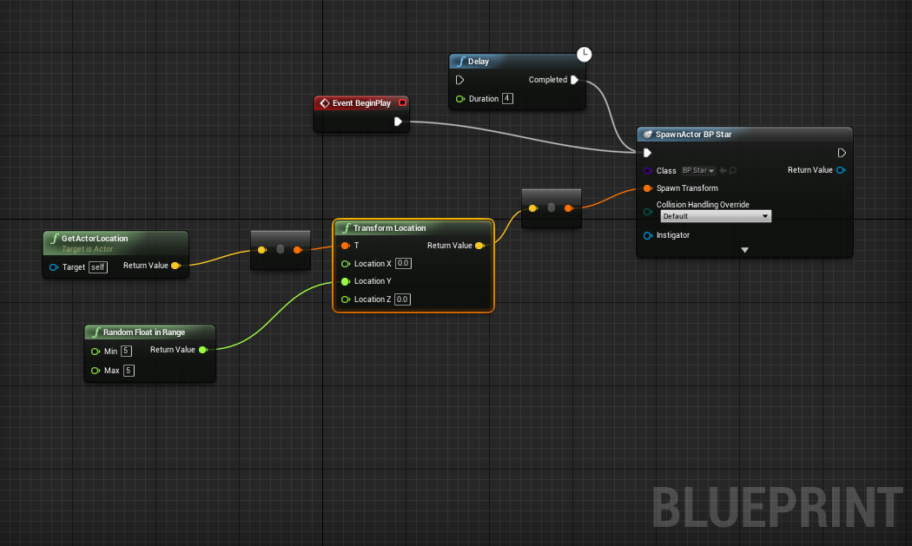
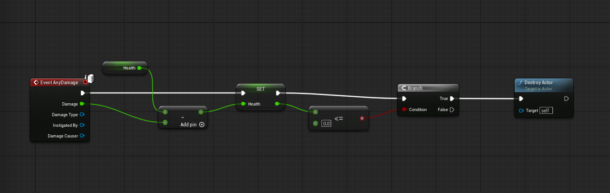
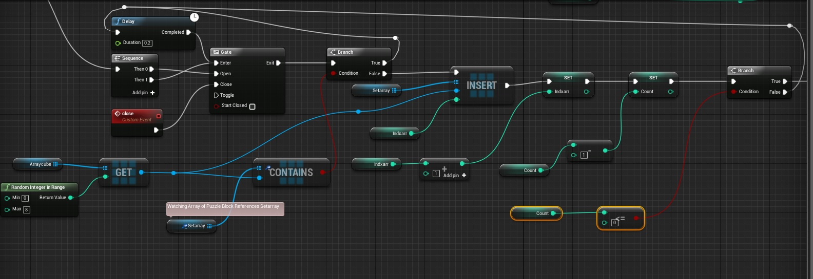
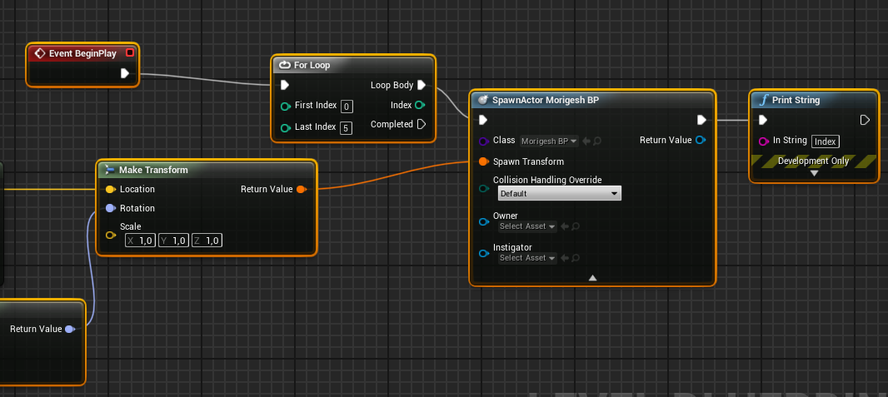
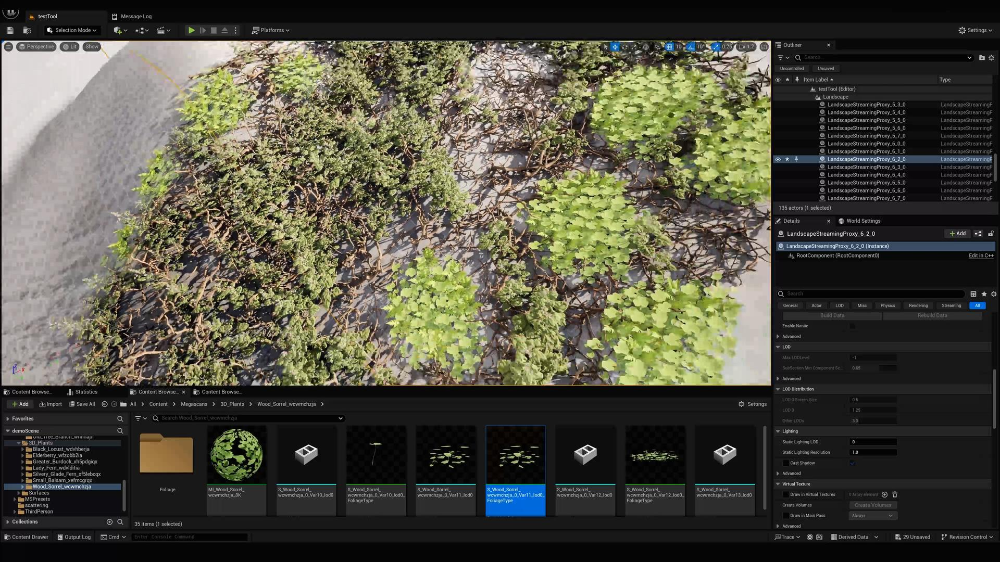

# Unreal Engine Procedural Spawner

A procedural spawning system built in Unreal Engine using Blueprints.
This system dynamically spawns actors within a defined area using randomization, allowing for flexible and reusable environment generation.

---

## 🎯 Features

* Randomized actor spawning within a defined volume
* Configurable spawn area using Box Collision
* Adjustable spawn count and frequency
* Random variation (location, rotation, scale, or mesh)
* Modular and reusable Blueprint setup

---

## 🧠 System Breakdown

### 🧱 Spawn Logic

The system generates random positions within a defined area and spawns actors using `Spawn Actor from Class`.
This forms the core logic responsible for procedural placement.

---

### 📦 Spawn Area

A Box Collision component defines the spawn boundaries.
All generated positions are constrained within this volume, allowing controlled distribution of spawned actors.

---

### 🎲 Randomization

Random values are applied to properties such as position, rotation, scale, or actor selection.
This ensures variation and prevents repetitive patterns in the spawned result.

---

### 🔁 Spawn Control

A loop or timer system controls how many actors are spawned and when.
This allows for both instant generation and time-based spawning behaviours.

---

### 🌍 Final Result

The final output shows multiple actors distributed across the environment using procedural logic.
This demonstrates how the system can be used to quickly populate scenes.

---

## 🚀 Future Improvements

* Add weighted spawning (rarity system for different actors)
* Replace box-based spawning with spline or grid-based placement
* Implement collision checks to avoid overlapping actors
* Add runtime spawning controls (e.g. player-triggered events)
* Integrate Niagara effects for dynamic spawning feedback

---

## ⚠️ Note

Some images are temporary placeholders for documentation purposes.  
They will be replaced with screenshots from the actual project as development progresses.
